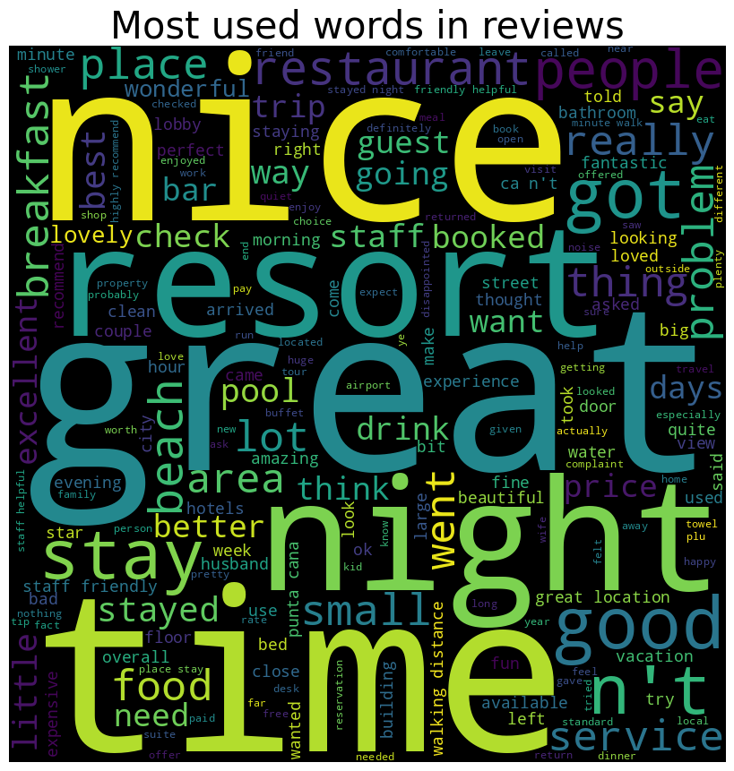
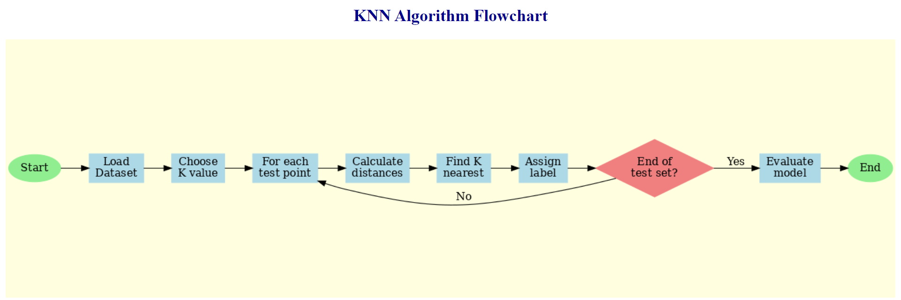
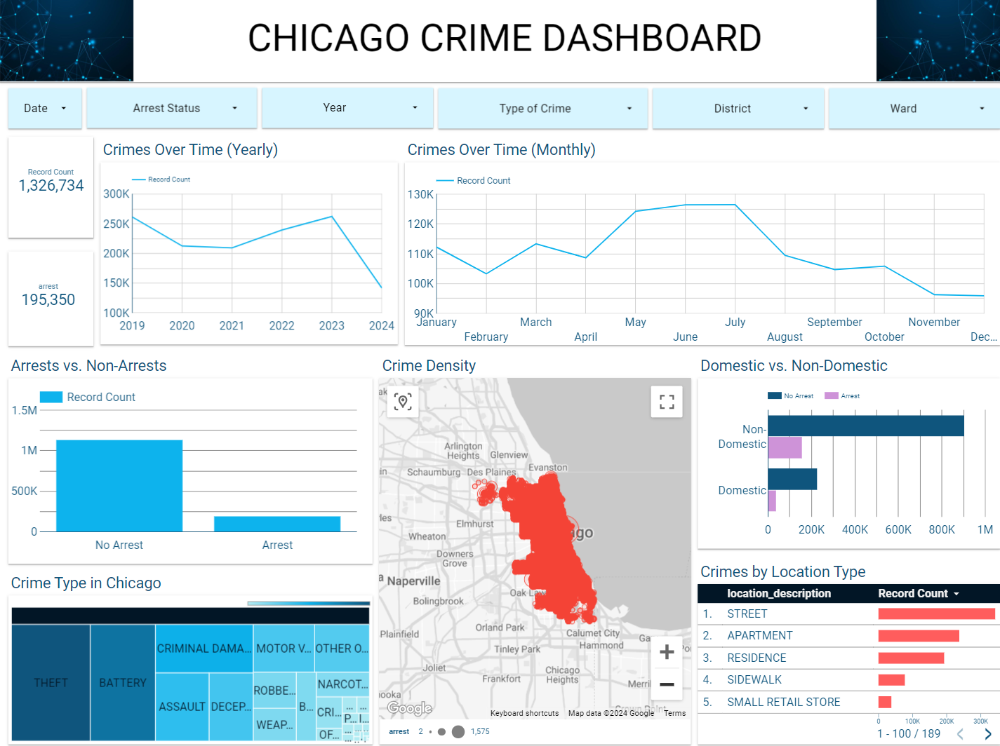

# Portfolio

---

## Natural Language Processing

### Sentiment Analysis on Tripadvisor reviews

Used sentiment analysis to understand how people feel about hotels and restaurants based on their TripAdvisor reviews.

 

 

---

## Supervised Machine Learning

### HR Attrition Analytics

Used the K-Nearest Neighbor model to analyze why employees might leave their jobs, helping companies keep their best workers.

 

The K-Nearest Neighbor model did a great job. It was right about 96.33% of the time when predicting outcomes. This means it made correct guesses for almost 96 out of every 100 cases. This high accuracy shows that the model is very good at understanding and predicting patterns in the data. It's a strong result that suggests the K-Nearest Neighbor method works well for this particular problem.

 

 

---

## Data Visualization and Bigquery SQL

### Chicago Crime Data in 2019 to 2024 Report

  
  - This group project's objective:-
  1. to find out if Chicago safe to live in 
  2. to find out if there is correlation between crime occurance and covid cases. 
  - Real world data is taken from <a href="https://data.cityofchicago.org/">Chicago Data Portal</a> website.

 

 
