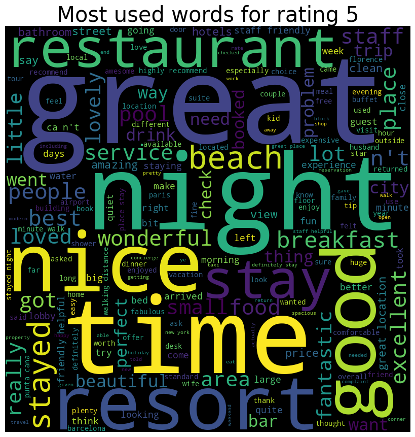

# Portfolio
---
## Natural Language Processing

### Sentiment Analysis on Tripadvisor reviews

Used sentiment analysis to understand how people feel about hotels and restaurants based on their TripAdvisor reviews.

---
## Supervised Machine Learning

### HR attrition analytics

Used the K Nearest Neighbor model to analyze why employees might leave their jobs, helping companies keep their best workers.

---
## Data Visualization and Bigquery SQL

### Chicago Crime Data in 2019 to 2024 Report

This group project's objective is to find out if Chicago safe to live in and to find out if there is correlation between crime occurance and covid cases. Real world data is taken from <a href="https://data.cityofchicago.org/">Chicago Data Portal</a> website.

 

 
